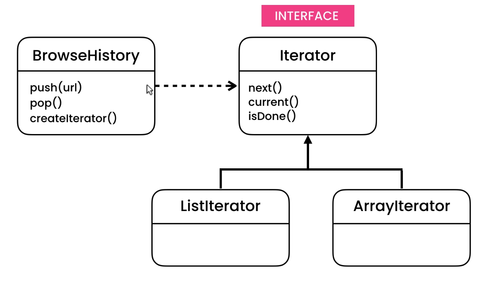

### Iterator pattern helps to iterate over a data structure
So if we change a data structure we are using for any purpose so using behavioural.iterator pattern to access it limits our change to support new data structure

