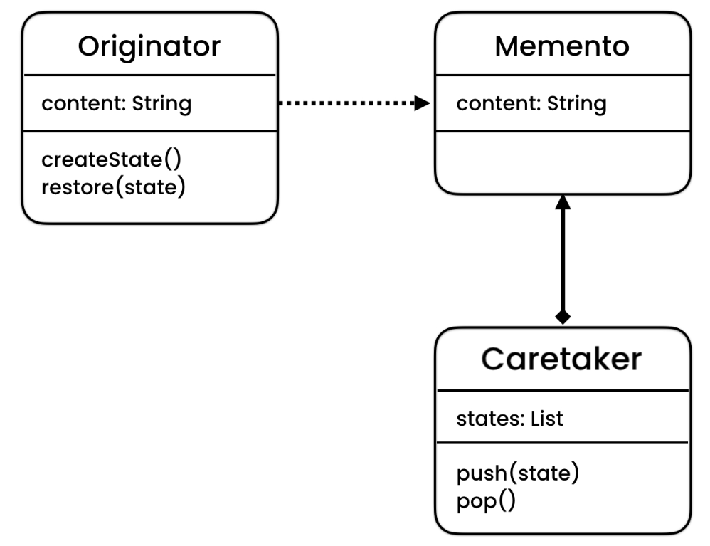

### To keep track and restore previous behavioural.state of an object

Originator is the original object for which we have to operate, behavioural.memento is the behavioural.state for the originator object and caretaker is the record of states of originator