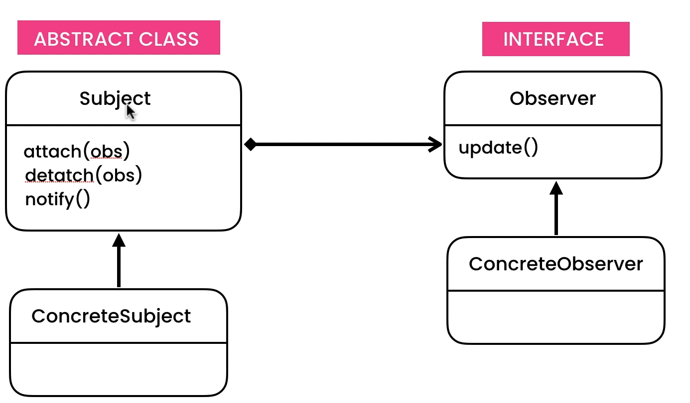

### To notify change of a subject to all observers

For getting updated value we can use either PULL technique and PUSH technique

PUSH - subject's notify method passed updated value on observer's update method using method parameters

PULL - subject should have a getValue() method, which observers can use to get latess value but then ConcreteObserver will be couples to ConcreteSubject 