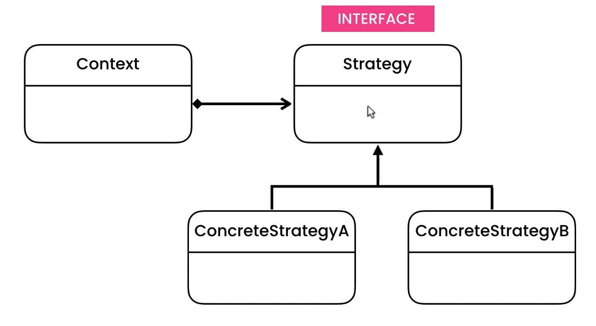

### To behave differently with respect to multiple states 

Very similar to behavioural.state pattern but the only difference is in behavioural.state pattern whole behaviour is dependent on single behavioural.state but in behavioural.strategy pattern mutliple states are there

