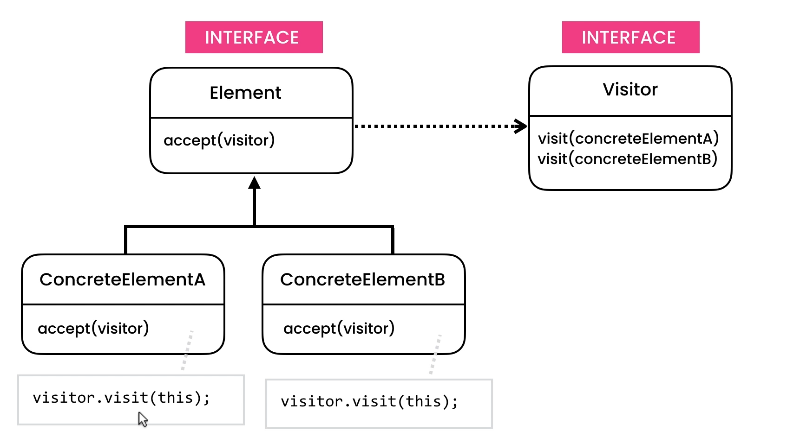

### To add more functionality over existing structure without disturbing

With current pattern if we want to introduce a new operation then we can simply implement Operation interface and use it, and it will not interfere with our existing implementation but adding a new HtmlNode type is something we need to avoid because then we need to add implementation for that specific node to all existing HtmlNode classes