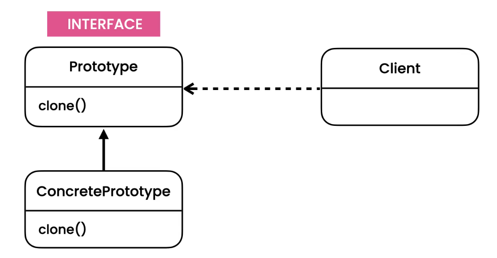

### Create new objects by copying

If we have clone method implementation in context menu class then whenever we add a new component we ned to modify our clone method inside context menu so we can shift this implementation from ContextMenu class to Component child class like Circle so every component can have its own implementation of cloning