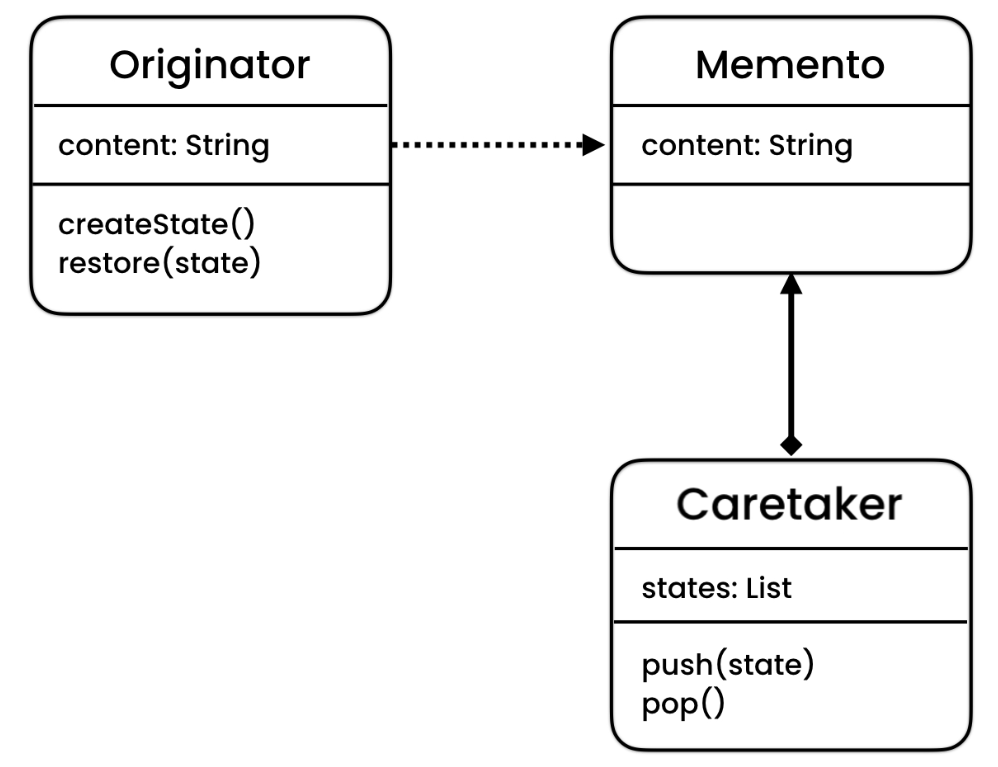

### To keep track and restore previous state of an object

Originator is the original object for which we have to operate, memento is the state for the originator object and caretaker is the record of states of originator