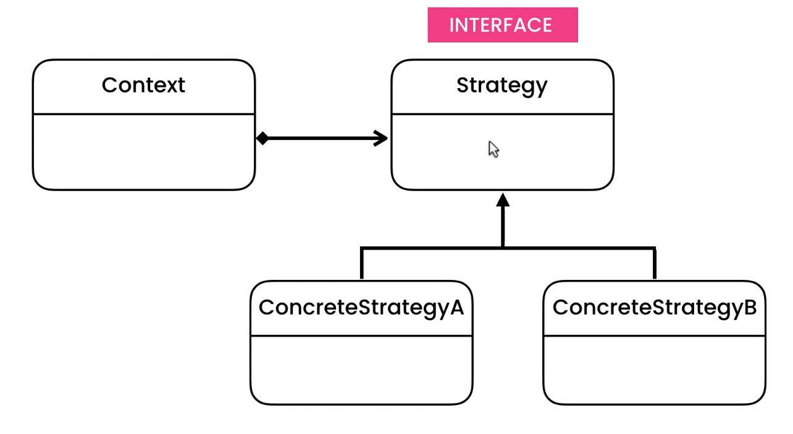

### To behave differently with respect to multiple states 

Very similar to state pattern but the only difference is in state pattern whole behaviour is dependent on single state but in strategy pattern mutliple states are there

