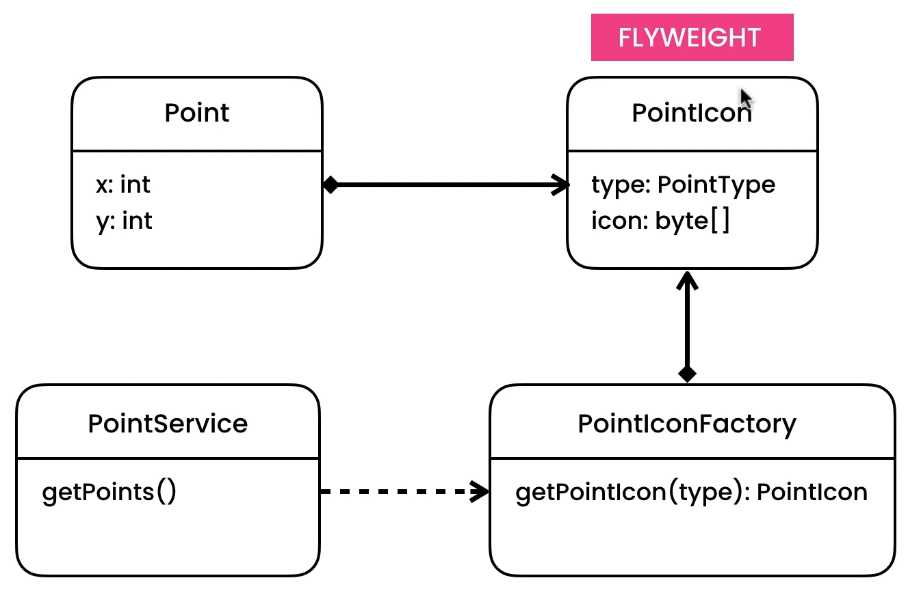

### To reduce memory usage for object creation

We can have separate PointIcon for separate Point which will lead us to store same icon data in multiple places wasting the device memory, so we can create a PointIconFactory who will create all types of icon single time and return us what we need   