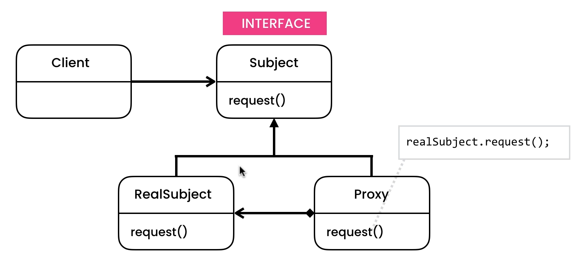

### To create a proxy between client and subject for caching and lazy loading

in current implementation we are adding only a proxy to ebook list because creating so much RealEbook could be costly, so we are only creating RealEbook when we need them (Lazy loading)